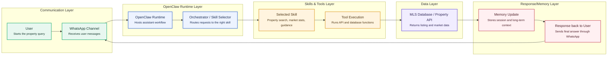

# OpenClaw MLS Assistant Architecture Flow

User queries are routed from WhatsApp through OpenClaw skills and tools to retrieve MLS/property data, update memory, and return a response.

```mermaid
flowchart LR
  classDef comm fill:#e8f7f0,stroke:#2fb47c,color:#12352a,stroke-width:2px
  classDef runtime fill:#edf3ff,stroke:#4977d6,color:#17294f,stroke-width:2px
  classDef skills fill:#fff4df,stroke:#e0a137,color:#4a3211,stroke-width:2px
  classDef data fill:#f1edff,stroke:#7c63d9,color:#2d2454,stroke-width:2px
  classDef response fill:#fff0f2,stroke:#cf5d70,color:#4b1d27,stroke-width:2px

  subgraph Communication["Communication Layer"]
    User["User<br/><small>Starts the property query</small>"]:::comm
    WhatsApp["WhatsApp Channel<br/><small>Receives user messages</small>"]:::comm
  end

  subgraph Runtime["OpenClaw Runtime Layer"]
    OpenClaw["OpenClaw Runtime<br/><small>Hosts assistant workflow</small>"]:::runtime
    Orchestrator["Orchestrator / Skill Selector<br/><small>Routes requests to the right skill</small>"]:::runtime
  end

  subgraph SkillsTools["Skills & Tools Layer"]
    Skill["Selected Skill<br/><small>Property search, market stats, guidance</small>"]:::skills
    Tools["Tool Execution<br/><small>Runs API and database functions</small>"]:::skills
  end

  subgraph Data["Data Layer"]
    Source["MLS Database / Property API<br/><small>Returns listing and market data</small>"]:::data
  end

  subgraph MemoryResponse["Response/Memory Layer"]
    Memory["Memory Update<br/><small>Stores session and long-term context</small>"]:::response
    Response["Response back to User<br/><small>Sends final answer through WhatsApp</small>"]:::response
  end

  User --> WhatsApp --> OpenClaw --> Orchestrator --> Skill --> Tools --> Source --> Memory --> Response --> WhatsApp
```
